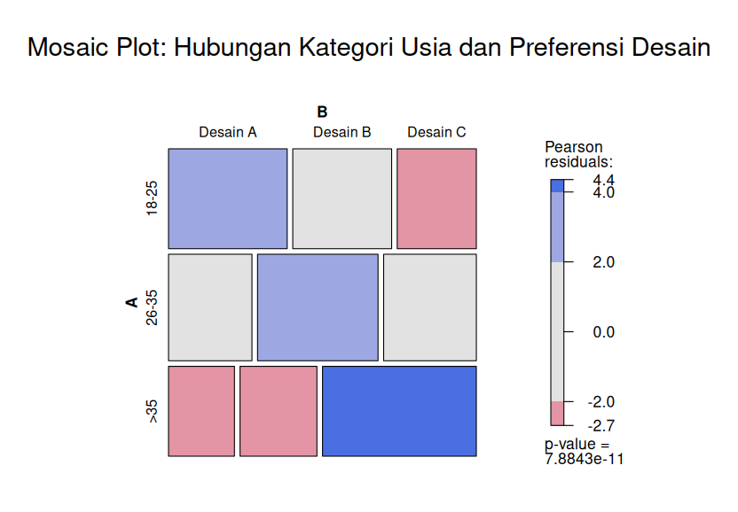
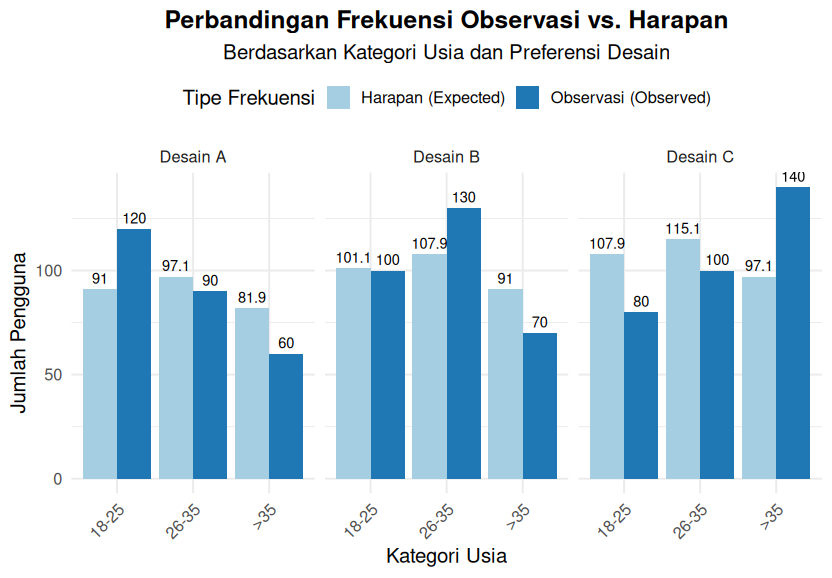

# Ujian Akhir Semester (UAS) - Statistical Thinking (Stat1)
## Studi Kasus 1: Uji Chi-Square - Hubungan Kategori Usia dan Preferensi Desain

### 1. Deskripsi Analisis

Analisis dilakukan untuk mengetahui apakah terdapat hubungan antara kategori usia pengguna dan preferensi terhadap tiga desain (A, B, C). Data observasi diolah menggunakan Uji Chi-Square, kemudian divisualisasikan dengan mosaic plot dan bar plot.

### 2. Hasil Mosaic Plot

- Mosaic plot menunjukkan distribusi frekuensi observasi dibandingkan dengan frekuensi harapan (expected).
- Warna biru menandakan frekuensi observasi lebih tinggi dari harapan, sedangkan warna merah menandakan lebih rendah dari harapan.
- Intensitas warna menunjukkan seberapa signifikan perbedaan antara observasi dan harapan.
- Dari plot, terlihat beberapa sel dengan warna biru/merah yang kuat, menandakan adanya perbedaan signifikan antara preferensi desain pada kelompok usia tertentu.

#### Visualisasi Mosaic Plot

### 3. Hasil Bar Plot

- Bar plot membandingkan jumlah pengguna (observasi vs. harapan) untuk setiap kombinasi kategori usia dan desain.
- Terlihat bahwa pada beberapa kategori, jumlah observasi jauh berbeda dari nilai harapan, misalnya:
  - Usia 18-25 lebih memilih Desain A dibandingkan harapan.
  - Usia >35 sangat menyukai Desain C dibandingkan harapan.
  - Usia 26-35 lebih memilih Desain B dibandingkan harapan.

#### Visualisasi Bar Plot

### 4. Kesimpulan

- Hasil Uji Chi-Square menunjukkan p-value yang sangat kecil (p < 0.05), sehingga terdapat hubungan signifikan antara kategori usia dan preferensi desain.
- Preferensi desain tidak merata di semua kelompok usia; masing-masing kelompok usia memiliki kecenderungan memilih desain tertentu.
- Visualisasi mosaic plot dan bar plot memperkuat temuan bahwa distribusi preferensi desain berbeda secara signifikan antar kelompok usia.